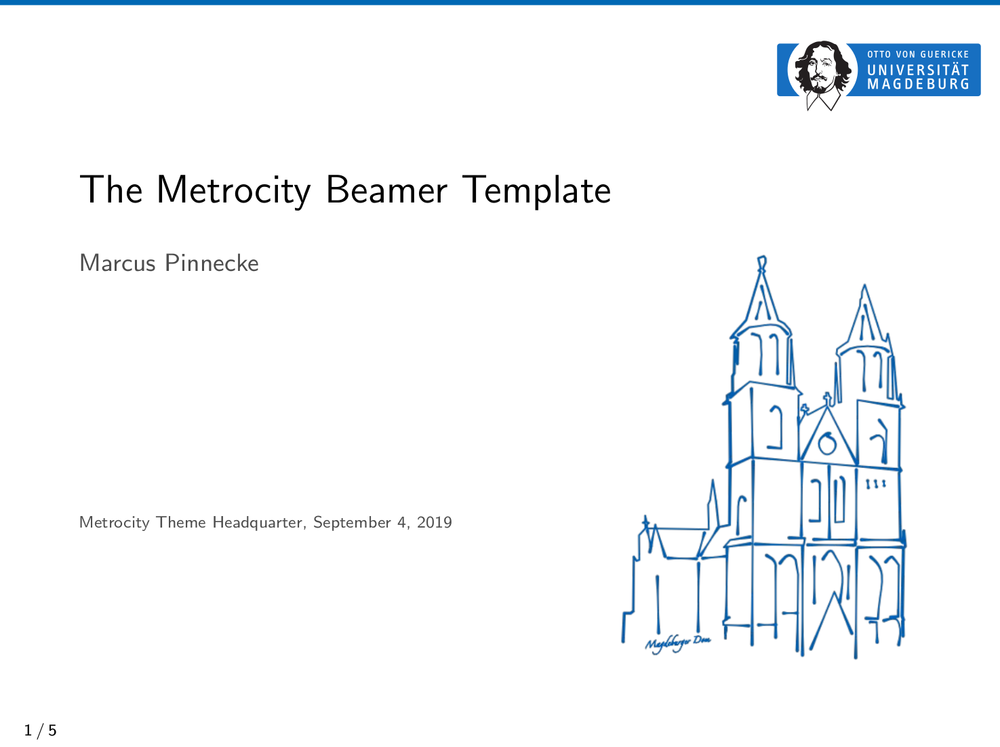
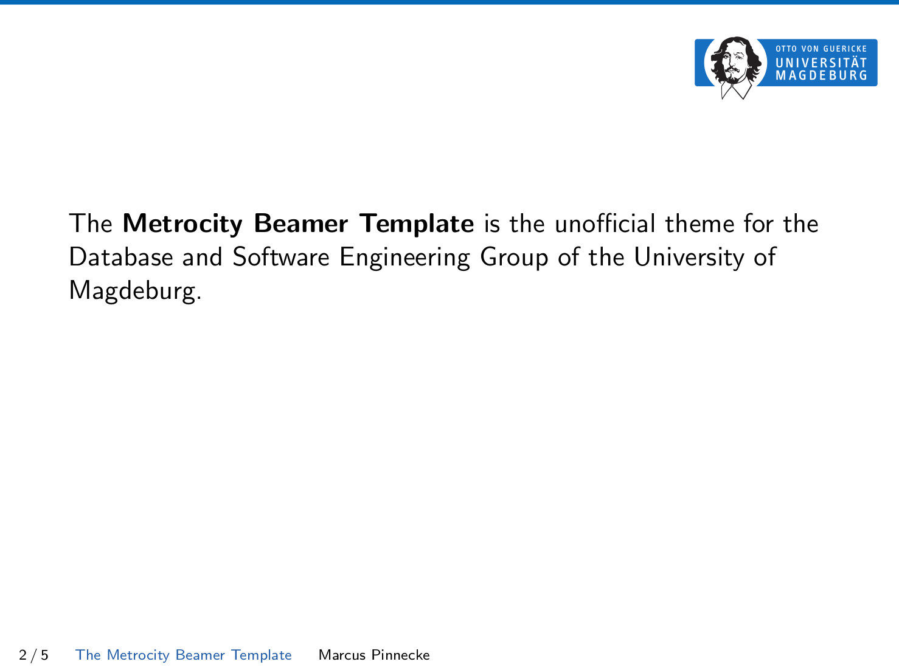
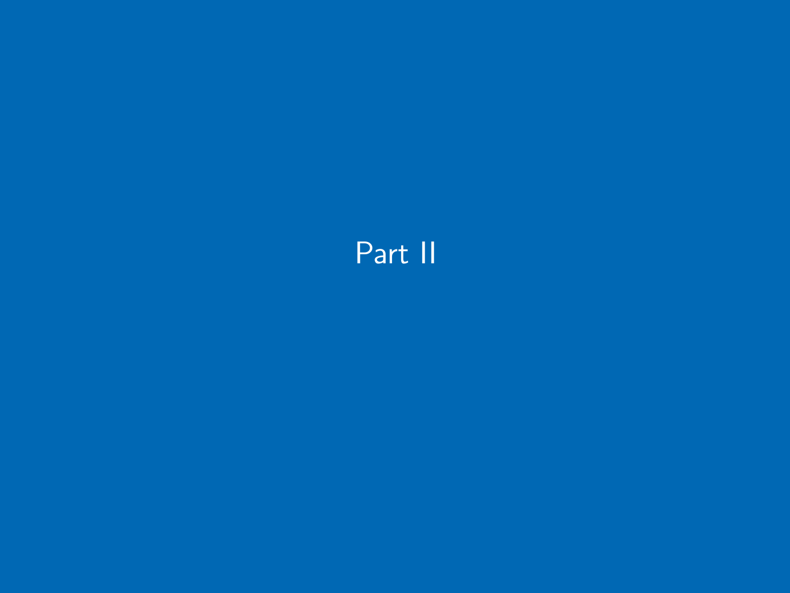
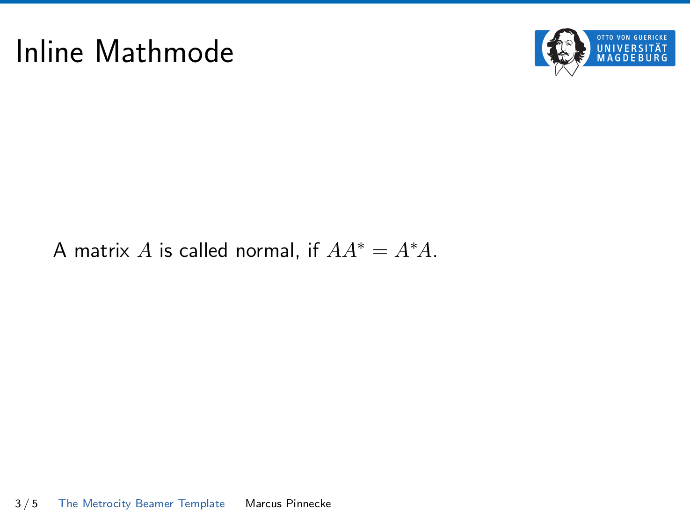
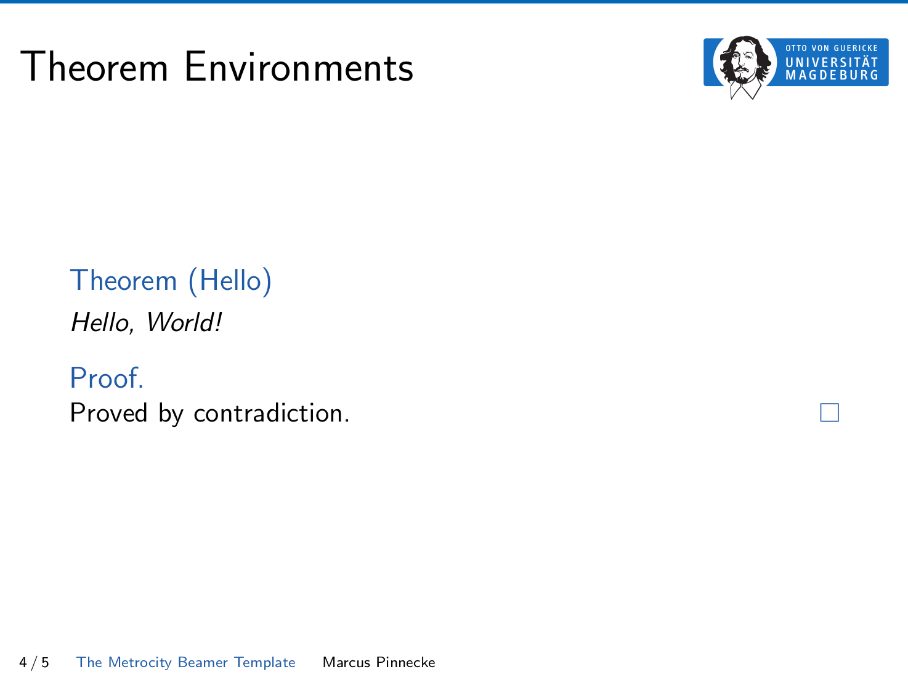
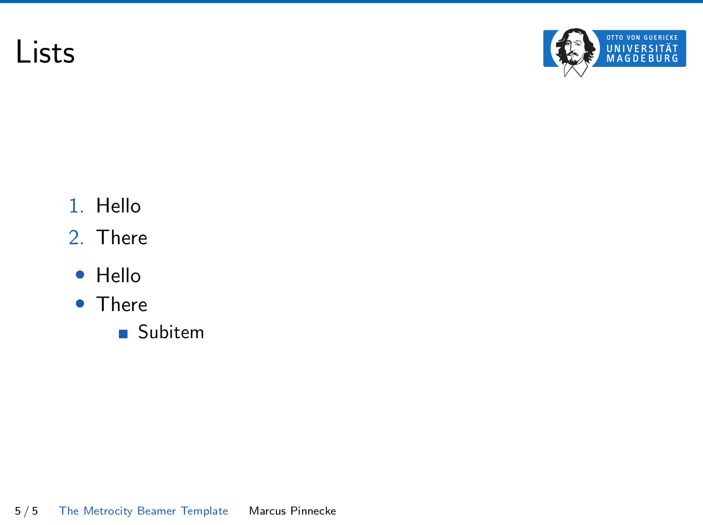

# The Metrocity Beamer Template

Metrocity (pronounced as by Megamind) is a lightweight, clean, and modern Beamer theme suitable for use in academic, especially in the Database and Software Engineering Group of the University of Magdeburg. 

Not yet convinced? Have a look at these demo slides:

<p float="left">
  
  
</p>

<p float="left">
  
  
</p>

<p float="left">
  
  
</p>


## Installation

For installation instructions, see [INSTALL.md](INSTALL.md).

## Usage

The following LaTex code is a minimal example of a Beamer presentation using Metrocity.


```
\documentclass{beamer}

% Use the metrocity theme
\usetheme{metrocity} 

\title{A Minimal Presentation}
\date{\today}
\author{Marcus Pinnecke}
\institute{Metrocity Theme Headquarter}

\begin{document}
  \maketitle

  \section{First Section}
  \begin{frame}{My First Slide}
    Hello, world!
  \end{frame}

\end{document}
```

Have a look at the [templates](templates) directory where you will find some nice frame templates.

## License

The Metrocity theme is licensed under [MIT License](https://opensource.org/licenses/MIT), which means you must keep the copyright notice of Metrocity intact when you use, copy, modify, merge, publish, distribute, sublicense, and/or sell copies of the Metrocity theme source code. This restriction does not affect presentations using the Metrocity theme.
