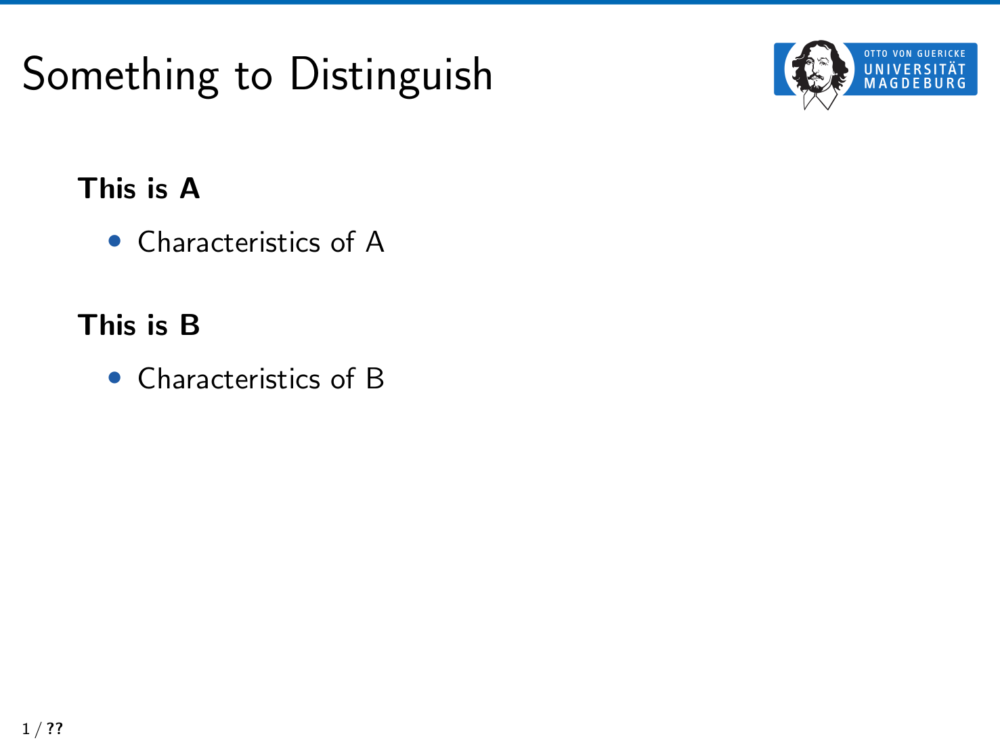

For the following frame



use the following code snippet

```tex
\begin{frame}[t]{Something to Distinguish}   
   \begin{spacing}{1.2}
    {\textbf{This is A}}
    \begin{itemize}
    	\item Characteristics of A
    \end{itemize}
    \vspace{1em}
    
    {\textbf{This is B}}
    \begin{itemize}
    	\item Characteristics of B
    \end{itemize}
    \end{spacing}
\end{frame}
```