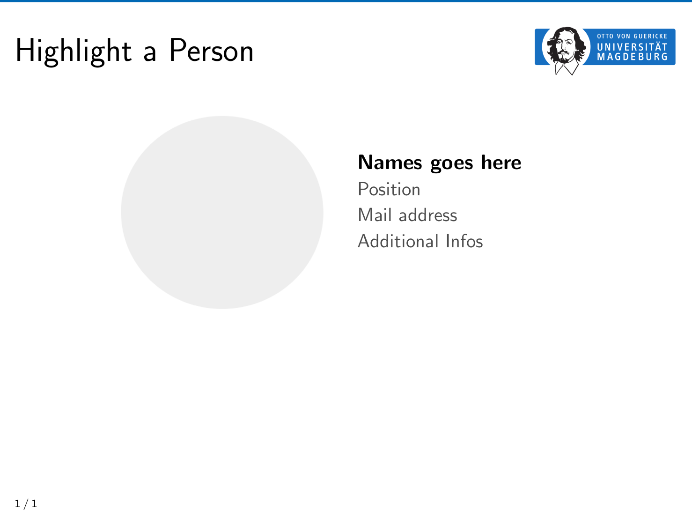

For the following frame



use the following code snippet

```tex
   \begin{frame}[t]{Highlight a Person}
      \begin{minipage}{0.48\linewidth}
         \flushright
            \includegraphics[width=0.8\textwidth]{highlight-person/avatar-placeholder.png}
      \end{minipage}
      \hfill
      \begin{minipage}{0.48\linewidth}
          \begin{spacing}{1.0}
             \textbf{Names goes here}\\
             \textcolor{gray}{
             	{\small Position}\\
             	{\small Mail address}\\
             	{\small Additional Infos}
             }
          \end{spacing}
      \end{minipage}
  \end{frame}
```