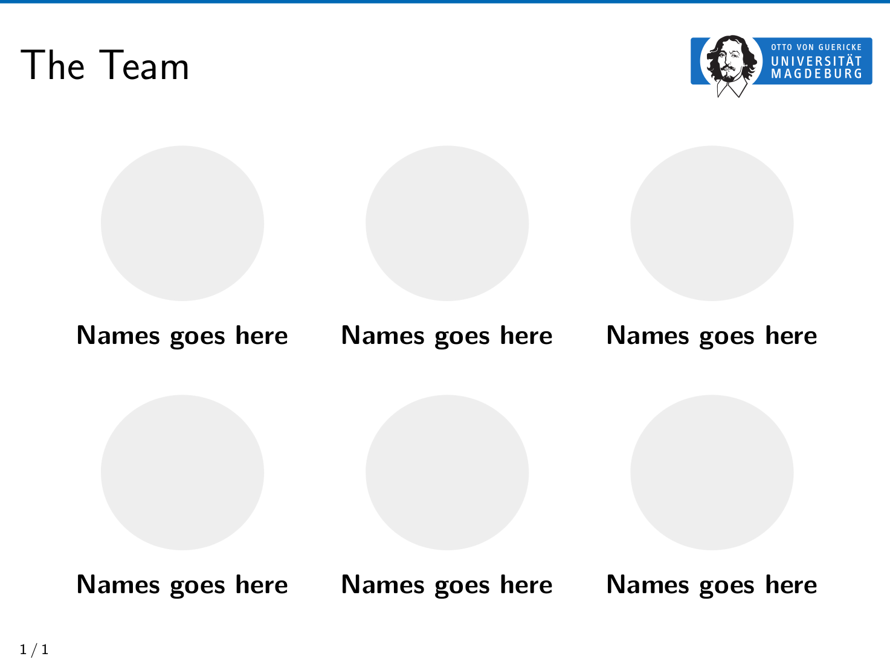

For the following frame



use the following code snippet

```tex
\begin{frame}[t]{The Team}
  \begin{minipage}{0.3\linewidth}
    \begin{center}
      \includegraphics[width=0.8\textwidth]{show-team/avatar-placeholder.png}\\
    \textbf{Names goes here}
    \end{center}
  \end{minipage}
  \hfill
  \begin{minipage}{0.3\linewidth}
    \begin{center}
      \includegraphics[width=0.8\textwidth]{show-team/avatar-placeholder.png}\\
    \textbf{Names goes here}
    \end{center}
  \end{minipage}
  \hfill
  \begin{minipage}{0.3\linewidth}
    \begin{center}
      \includegraphics[width=0.8\textwidth]{show-team/avatar-placeholder.png}\\
    \textbf{Names goes here}
    \end{center}
  \end{minipage} \\~\\~\\

  \begin{minipage}{0.3\linewidth}
    \begin{center}
      \includegraphics[width=0.8\textwidth]{show-team/avatar-placeholder.png}\\
    \textbf{Names goes here}
    \end{center}
  \end{minipage}
  \hfill
  \begin{minipage}{0.3\linewidth}
    \begin{center}
      \includegraphics[width=0.8\textwidth]{show-team/avatar-placeholder.png}\\
    \textbf{Names goes here}
    \end{center}
  \end{minipage}
  \hfill
  \begin{minipage}{0.3\linewidth}
    \begin{center}
      \includegraphics[width=0.8\textwidth]{show-team/avatar-placeholder.png}\\
    \textbf{Names goes here}
    \end{center}
  \end{minipage} \\
end{frame}
```