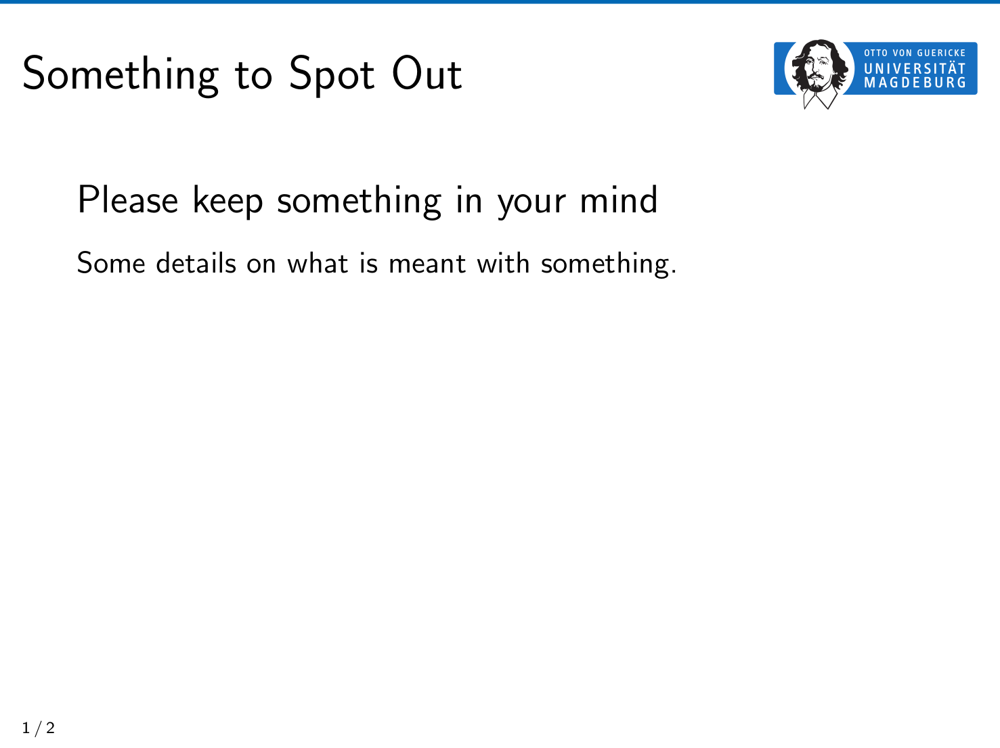

For the following frame



use the following code snippet

```tex
  \begin{frame}[t]{Something to Spot Out}
    \begin{spacing}{1.6}
      {\Large Please keep something in your mind}
      Some details on what is meant with something.
    \end{spacing}
  \end{frame}
```